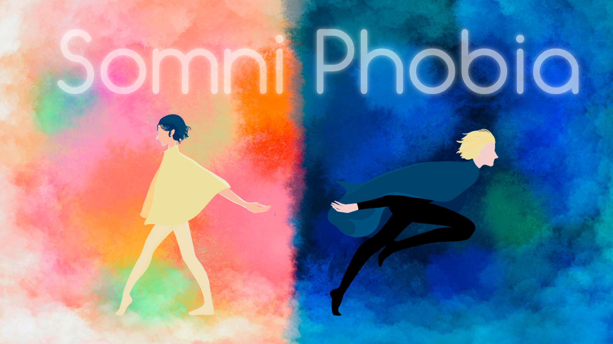

# Somniphobia

Welcome to Somniphobia! Control the characters using the following control scheme:

Left/Right arrow keys: Move left/right

Up arrow key: Jump

arrow keys + Shift (or Space): Dash in direction of arrow keys (8 directions)

Z (or E): Toggle holding hands

X (or Q): Switch between our two characters Somni and Phobia

WASD: Camera panning

R: Restart the current level

The goal of this game is to get both Somni and Phobia to the red exit door while holding hands. Somni can interact with light platforms and Phobia can interact with dark platforms. The combined platforms can interact with both characters. In addition, there are special platforms such as rain clouds which disappear if Somni and Phobia are holding hands on it, lightning clouds which will shock either character and result in a loss, and moving platforms which can be regular or special.  The movement and jumping are the standard movements for 2D platformers. Dashing can be done in eight possible directions: the four cardinal directions as well as diagonally if two arrow keys are held before dashing. If a dash is performed without pressing any arrow keys, the dasher will dash in the direction they're facing. Somni and Phobia are able to hold hands if they are close enough to each other. Switching will either allow the player to control the opposite character or switch the leading character if they are holding hands. When a dash is performed while holding hands, the leading character performs a dash while the other character is left behind. This dash, known as the propel, allows the leading character to dash once more. One propel and one dash is able to be performed before a character touches the ground.
